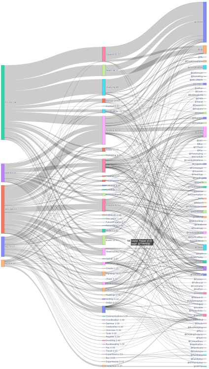

# Time Tracking Summarizer
A CLI tool to process timetracking text files. It produces summaries and a snakey diagram.

The recorded lines are of a format:
```
Mon 4.1.2022
12:00-12:15 @Wrote some @Docs ( @RES + @HOB + @HOB )
```
Where `@Wrote`, `@Docs` are tags the `@Wrote` being the main activity due to its position. The `@RES` and `@HOB` tags
given inside the parenthesis are used to indicate the project or job the task belongs to. If multiple are given, the
time is divided evenly among them (or, in this case 1/3 to `@RES` and 2/3 to `@HOB`).

Some other features:
 * Can read multiple files and supports wildcards for the input filenames.
 * CLI options to select only one project/category and filter lines based on including and excluding keywords.
 * Option to scale output to only span specific number of minutes. Useful for fixed hours contracts.
 * Option to only count `@Tag` fequencies and apply transformations through tag aliases.
 * Can output a snakey diagram that illustrates how you have used your time on this earth.

Pull requests to implement additional visualizations such as activity diagrams etc. are welcome.

Example of the snakey output. The picture has been scaled down. You need not to see my data, record your own!:


